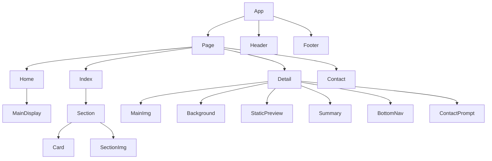

# Portfolio Site Generator Technical Specification

Last Edited: August 11, 2022 5:14 PM

# Overview

- Developer edits JSON specification in this project,  scaffolds a portfolio site displaying their contact information and projects, and is free to edit the components and CSS.

# Technical Requirements

- Figma:
- Developers should be able to modify a file containing a specification with the following properties:
    - Logo file location
    - Name
    - Contact
        - email
        - phone
        - social media
    - List of pages
        - Each page has a type, associated media, and links
        - There are 4 types of pages
            - Home
            - PortfolioIndex
            - PortfolioDetail
            - Contact

# Proposed solution

## User Stories

- Developer fills out a specification of the specified format
- Developer runs the react application and a portfolio is site is scaffolded according to the specification

## Data Model

- This site’s content will be statically hosted
- Media will be stored locally until performance dictates an alternative solution
- content.ts module will import json spec and store elements in appropriate constants
- hooks will import values from content.ts for use in the application. This will make it easier to use an api for this function in the future

## Business Logic

### Component Hierarchy



### Example JSON Spec

```json
{
	"siteTitle": "Pstringe",
	"author": "Poitier Stringer",
	"jobTitle": "Software Engineer",
	"logo": "[path]",
	"pages": [
		{
			"type": "HOME",
			"media": {
				"mainImg": "[path]",
				"secondaryImg": "[path]"
			},
			"about": "I’m a ${AUTHOR_TITLE} looking for a new interesting projects to work on. I specialize in developing fullstack applications for business needs. Some industries I've worked in include, health-tech, eccomerce, and education. I'm based in the San Francisio Bay area but I’m happy working remotely and have experience in remote teams. When I’m not coding, you’ll find me reading, writing, playing guitar, or spending time outdoors. I love being out in nature whether that’s going for a walk, slack lining, or riding my electric long-board. I’d love you to check out my work.",
			"greeting": "Hey, I’m ${AUTHOR_NAME} and I love building beautiful websites",
		},
		{
			"title": "manage",
			"type": "DETAIL",
			"link": "[url]",
			"background": "This project was a front-end  challenge from Frontend Mentor. It’s a platform that enables you to practice building websites to a design and project brief. Each challenge includes mobile and desktop designs to show how the website should look at different screen sizes. Creating these projects has helped me refine my workflow and solve real-world coding problems. I’ve learned something new with each project, helping me to improve and adapt my style.",
			"tags": [
					"Interaction Design/Front End Development",
					"HTML/CSS/JS"
			],
			"media": {
				"mainImg": "[path]",
			},
			"pageOrder": {
				"next":"",
				"prev":""
			}
		},
		{
			"type": "INDEX"
			/*
			renders using data provided in page specifications of type "DETAIL"
			*/
		},
		{
			"type": "CONTACT",
			"message": "I’m a ${AUTHOR_TITLE} looking for a new interesting projects to work on. I specialize in developing fullstack applications for business needs. Some industries I've worked in include, health-tech, eccomerce, and education. I'm based in the San Francisio Bay area but I’m happy working remotely and have experience in remote teams. When I’m not coding, you’ll find me reading, writing, playing guitar, or spending time outdoors. I love being out in nature whether that’s going for a walk, slack lining, or riding my electric long-board. I’d love you to check out my work.",
			"social": {
				"gh": "[url]",
				"linkedin":"[url]"
            }
	
		},
	],
}
```

## Presentation Layer

[https://www.figma.com/embed?embed_host=share&url=https%3A%2F%2Fwww.figma.com%2Ffile%2FpOTjiJ4ojw5k6Rz92XmcET%2Fminimalist-portfolio-website%3Fnode-id%3D0%253A1](https://www.figma.com/embed?embed_host=share&url=https%3A%2F%2Fwww.figma.com%2Ffile%2FpOTjiJ4ojw5k6Rz92XmcET%2Fminimalist-portfolio-website%3Fnode-id%3D0%253A1)

## Available Scripts

In the project directory, you can run:

### `yarn start`

Runs the app in the development mode.\
Open [http://localhost:3000](http://localhost:3000) to view it in the browser.

The page will reload if you make edits.\
You will also see any lint errors in the console.

### `yarn test`

Launches the test runner in the interactive watch mode.\
See the section about [running tests](https://facebook.github.io/create-react-app/docs/running-tests) for more information.

### `yarn build`

Builds the app for production to the `build` folder.\
It correctly bundles React in production mode and optimizes the build for the best performance.

The build is minified and the filenames include the hashes.\
Your app is ready to be deployed!

See the section about [deployment](https://facebook.github.io/create-react-app/docs/deployment) for more information.

### `yarn eject`

**Note: this is a one-way operation. Once you `eject`, you can’t go back!**

If you aren’t satisfied with the build tool and configuration choices, you can `eject` at any time. This command will remove the single build dependency from your project.

Instead, it will copy all the configuration files and the transitive dependencies (webpack, Babel, ESLint, etc) right into your project so you have full control over them. All of the commands except `eject` will still work, but they will point to the copied scripts so you can tweak them. At this point you’re on your own.

You don’t have to ever use `eject`. The curated feature set is suitable for small and middle deployments, and you shouldn’t feel obligated to use this feature. However we understand that this tool wouldn’t be useful if you couldn’t customize it when you are ready for it.

## Learn More

You can learn more in the [Create React App documentation](https://facebook.github.io/create-react-app/docs/getting-started).

To learn React, check out the [React documentation](https://reactjs.org/).
